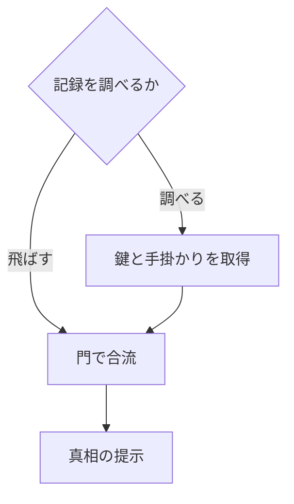

# 説明用の固定データ

[branching-clue.example.json](branching-clue.example.json)は、鍵を取得する/しない道が合流し、必須手掛かりの提示差が残る例。UUID、条件AST、期待経路と期待状態を含む。完全な専用archiveや実装済みengineではない。

- 二経路の合流先は同じでもhas_keyはtrue/falseの差を保つ。
- 手掛かりを飛ばす経路は真相へ到達し、提示不足の証人経路になる。
- 過去出来事のtickは-10。改名や表示単位の変更で値は変わらない。
- 人物の知識と読者への提示、人間が理解したかを区別する。

scripts/check_docs.pyはID/参照/経路の構造を検査する。条件評価、状態遷移、ZIP往復、実端末の試験を実行したと解釈しない。WP01で完全な型/fixtureと失敗系、WP11–WP16で実行器と検証を作る。

| 経路 | 合流時の鍵 | 手掛かりの提示 | 検査結果 |
| --- | --- | --- | --- |
| 調べる | あり | あり | 必須提示を満たす |
| 飛ばす | なし | なし | 提示不足の証人経路 |

同じ門へ到達しても状態は異なる。真相に到達しただけで、手掛かりやプレイヤーの理解があるとは判定しない。
